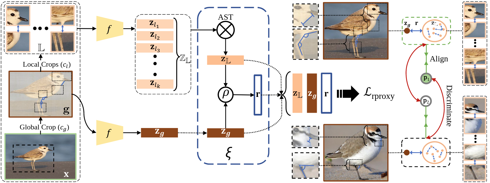

# Relational Proxies: Emergent Relationships as Fine-Grained Discriminators

Official implementation of "[Relational Proxies: Emergent Relationships as Fine-Grained Discriminators](https://proceedings.neurips.cc/paper_files/paper/2022/hash/c9f95e9ec39fa5ad3d0a562b993b92aa-Abstract-Conference.html)",
NeurIPS 2022 (Spotlight).\
Additional links: [Spotlight Presentation](https://nips.cc/virtual/2022/spotlight/65257) | [arXiv](https://arxiv.org/abs/2210.02149) | [Video & Poster](https://nips.cc/virtual/2022/poster/54901)

Our framework helps learn a cross-view representation by modelling local-to-global emergent relationships
for Fine-Grained Visual Categorization (FGVC).



## Environment Setup

This project is implemented using PyTorch. A conda environment with all related dependencies can be created as follows:
1. Clone the project repository:
```shell
git clone https://github.com/abhrac/relational-proxies.git
cd relational-proxies
```
2. Create and activate conda environment:
```shell
conda env create -f environment.yml
conda activate relational-proxies
```
3. Download the .pth file from
[here](https://drive.google.com/file/d/1P556ct4WTxWgZSLsKj4k9PZ52g6StGFA/view?usp=sharing)
and place it in the `./view_extractor/` folder under the project root.

## Training
To train the model from scratch, run the following:
```shell
python3 src/main.py --data_root='RootDirOfAllDatasets' --dataset='DatasetName'
```
The `run_expt.sh` file contains sample training commands.

## Evaluation
To evaluate on a dataset using pretrained weights, first download the model for the corresponding dataset from
[here](https://drive.google.com/drive/folders/1WR9qqFmhArHJqg78wsffhQtAbiW3V77R?usp=sharing)
and place it under the folder `./checkpoint/$DataSetName/`,
where `./checkpoint` is under the project root, but could optionally be elsewhere too
(see `src/options.py`). Then, run the following command:
```shell
python3 src/main.py --data_root='RootDirForAllDatasets' --dataset='DatasetName' --pretrained --eval_only
```

## Results
| |FGVC Aircraft | Stanford Cars |CUB | NABirds | iNaturalist | Cotton Cultivar | Soy Cultivar |
|:-|:-:|:-:|:-:|:-:|:-:|:-:|:-:|
|MaxEnt, NeurIPS'18 | 89.76 | 93.85 | 86.54 | - | - | - | - |
|DBTNet, NeurIPS'19 | 91.60 | 94.50 | 88.10 | - | - | - | - |
|StochNorm, NeurIPS'20 | 81.79 | 87.57 | 79.71 | 74.94 | 60.75 | 45.41 | 38.50 |
|MMAL, MMM'21 | 94.70 | 95.00 | 89.60 | 87.10 | 69.85 | 65.00 | 47.00 |
|FFVT, BMVC'21 | 79.80 | 91.25 | 91.65 | 89.42 | 70.30 | 57.92 | 44.17 |
|CAP, AAAI'21 | 94.90 | 95.70 | 91.80 | 91.00 | - | - | - |
|TransFG, AAAI'22 | 80.59 | 94.80 | 91.70 | 90.80 | 71.70 | 45.84 | 38.67 |
|**Ours (Relational Proxies)** | **95.25** $\pm$ 0.02| **96.30** $\pm$ 0.04 | **92.00** $\pm$ 0.01 | **91.20** $\pm$ 0.02 |**72.15** $\pm$ 0.03 | **69.81** $\pm$ 0.04 | **51.20** $\pm$ 0.02|

## Citation
```
@inproceedings{Chaudhuri2022RelationalProxies,
 author = {Abhra Chaudhuri and Massimiliano Mancini and Zeynep Akata and Anjan Dutta},
 booktitle = {Proceedings of Advances in Neural Information Processing Systems (NeurIPS)},
 title = {Relational Proxies: Emergent Relationships as Fine-Grained Discriminators},
 year = {2022}
}
```
